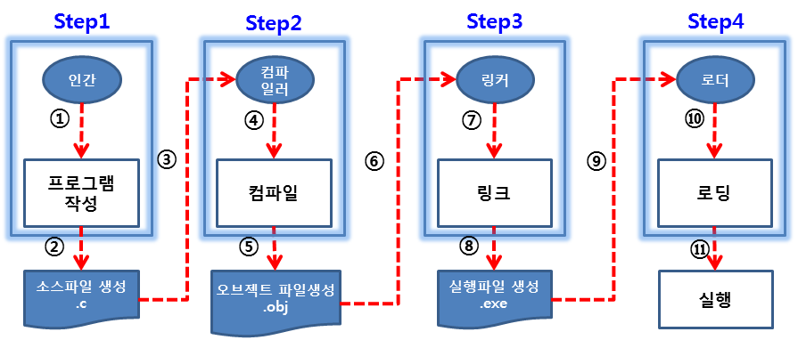

- [Part1-1장. C언어의 소개와 프로그램 작성 방법](#part1-1장-c언어의-소개와-프로그램-작성-방법)
  - [1. 소프트웨어란?](#1-소프트웨어란)
  - [2. 엔지니어와 프로그래머의 차이](#2-엔지니어와-프로그래머의-차이)
  - [3. C언어란 무엇인가](#3-c언어란-무엇인가)
  - [4. 컴파일러란 무엇인가](#4-컴파일러란-무엇인가)
  - [5. 프로그램 작성 방법 4단계 – 이론](#5-프로그램-작성-방법-4단계--이론)
  - [6. 프로그램 작성 방법 4단계 – 실습](#6-프로그램-작성-방법-4단계--실습)
  - [7. C언어의 특징](#7-c언어의-특징)
  - [8. C언어의 학습 방식](#8-c언어의-학습-방식)

# Part1-1장. C언어의 소개와 프로그램 작성 방법

## 1. 소프트웨어란?

- 소프트웨어

  - 컴퓨터 프로그램
  - 인간은 컴퓨터에게 명령을 내리고 컴퓨터는 이에 대해 응답을 함

- 소프트웨어 개발 프로세스: 소프트웨어를 만드는 절차
  - 요구사항 명세화 ⇄ 설계 ⇄ 구현 ⇄ 테스트 ⇄ 유지보수

## 2. 엔지니어와 프로그래머의 차이

- 엔지니어

  - 프로젝트 팀의 전문가 → 프로젝트(소프트웨어 개발 프로세스)를 관리함
  - 요구사항의 분석 및 설계, 구현(프로그램), 테스트&유지보수

    ex) 거대한 빌딩, 무인 전투기

- 프로그래머

  - 작은 규모의 프로그램을 개발하는 사람
  - 조직이 작은 경우 엔지니어와 프로그래머가 하는 일이 거의 같음

    ex) 강아지 집

> 코더 → 프로그래머 → 엔지니어 (엔지니어가 되려면 프로그래머가 하는 일 해야 함)

## 3. C언어란 무엇인가

- C언어: 인간과 컴퓨터 사이의 의사소통을 위한 프로그래밍 언어

- 프로그래밍 언어의 종류: C언어, C++언어, C#언어, Java언어, Python언어

- 프로그램: 프로그래밍 언어로 프로그래밍한 작업 결과

  - C프로그램, C++프로그램, C#프로그램, Java프로그램, Python프로그램

- 프로그래머: 프로그래밍을 하는 사람

  - C프로그래머, C++프로그래머, C#프로그래머, Java프로그래머, Python프로그래머

- C언어의 탄생: 미국 AT&T사의 벨(Bell) 연구소의 연구원들이 만듦
  - ①ALGOL 60 → ②CPL → ③BCPL → ④B → ⑤C
    - ①②③: 인간이 배우기 너무 어려움
    - ④: ①②③을 보완했지만 이식성이 떨어짐(켄톰슨)
    - ⑤: 이식성을 높임(데니스리치)

> 프로그램의 철학: 비용은 적게 들고 효과는 높이자! → 재사용을 하자

## 4. 컴파일러란 무엇인가

- 컴파일러: 인간이 만든 프로그램을 기계가 이해하도록 기계어로 변환하는 변환기

  - 실세계: 한국인 - 통역관 - 미국인
  - 컴퓨팅세계: 인간(C언어) - 컴파일러(C컴파일러) - 컴퓨터(기계어)

- 기계어: 컴파일러가 컴파일해서 얻은 결과 → 기계가 이해하는 2진수(0과 1)로 작성된 언어

## 5. 프로그램 작성 방법 4단계 – 이론

1. 인간이 C언어로 프로그램 작성 → 소스파일(`.c` 파일)
2. 컴파일러(해석기)가 `.c` 파일을 입력받음 → 오브젝트 파일=기계어 파일(`.obj`)
3. 링커는 기계가 이해할 수 있는 `.obj` 파일을 링크(연결)함 → 실행파일(`.exe`)
4. 로더가 `.exe` 파일을 가지고 와서 메모리에 로딩함 → cpu가 실행

> 1~4까지의 작업을 도와주는 소프트웨어: 통합 개발 소프트웨어

## 6. 프로그램 작성 방법 4단계 – 실습

1. 프로그램 작성

   - 파일-새로 만들기-프로젝트
   - 소스파일-추가-새 항목 (확장자 `.c`를 안 적어주면 C++파일이 됨)
     - 프로그램 작성 영역에 코드(명령문자) 작성

   > 한 프로젝트 안에는 `.c` 파일 여러 개 만들 수 있음

2. 컴파일

   - 빌드-컴파일
   - 문법에 오류가 생기면 컴파일이 안 됨 (오류가 난 부분은 `F4`키를 누르면 알 수 있음)

   > 디버그 폴더: 컴파일 시 오류가 없을 경우에 기계어 파일을 모아둠

3. 링크

   - 빌드-솔루션 빌드 (실행 파일 이름은 프로젝트 이름으로 만들어짐)
   - 프로젝트 이름: `HelloWorld`, 소스파일 이름: `Hello.c`
     - 실행파일 이름: `HelloWorld.exe`(O), `Hello.exe`(X)

4. 실행
   - 디버그-디버깅하지 않고 시작
   - `계속하려면 아무키나 누르십시오...` → 시스템에서 그냥 찍어주는 메시지

## 7. C언어의 특징

1. 이식성과 효율성이 높음 (어떤 환경에 가도 실행시킬 수 있음)
2. 다른 프로그래밍 언어를 배우기에 좋음
3. 지능형 서비스 로봇 제어
4. 절차지향 언어 (순서를 가지고 있음)

## 8. C언어의 학습 방식

- 1단계: 교재에 있는 코드를 분석
- 2단계: 분석된 내용을 통해 교재를 참고하지 않고 코드 작성
- 3단계: 나만의 코드 작성 후, 교재의 코드와 비교
