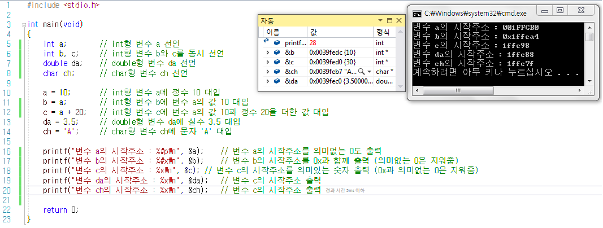
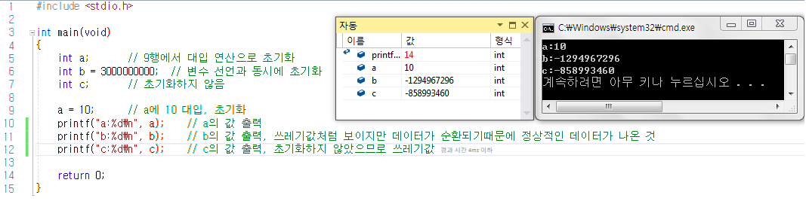
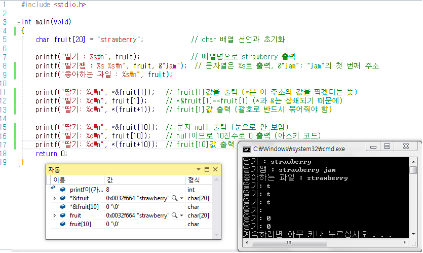
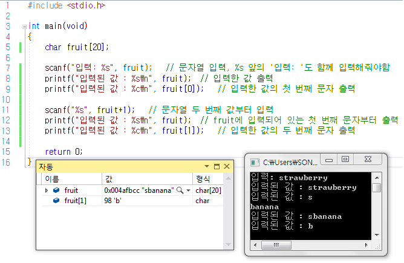

- [Part1-3장. 변수란 무엇인가](#part1-3장-변수란-무엇인가)
  - [변수의 시작주소](#변수의-시작주소)
  - [쓰레기값](#쓰레기값)
  - [문자열 저장과 출력](#문자열-저장과-출력)
  - [strcpy함수](#strcpy함수)
  - [문자열 입력과 출력](#문자열-입력과-출력)

# Part1-3장. 변수란 무엇인가

## 변수의 시작주소

## 쓰레기값

## 문자열 저장과 출력

## strcpy함수

## 문자열 입력과 출력

