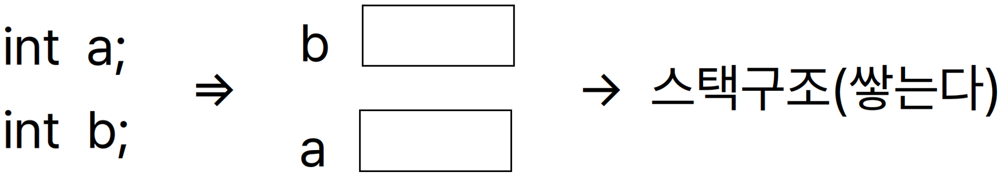

- [Part1-3장. 변수란 무엇인가](#part1-3장-변수란-무엇인가)
  - [1. 변수 선언하기(=변수 만들기)](#1-변수-선언하기변수-만들기)
  - [2. 변수 선언 시 주의할 점](#2-변수-선언-시-주의할-점)
  - [3. 변수의 시작주소와 \&연산자](#3-변수의-시작주소와-연산자)
  - [4. scanf 함수](#4-scanf-함수)

# Part1-3장. 변수란 무엇인가

## 1. 변수 선언하기(=변수 만들기)

- 변수: 데이터를 저장하는 임시 저장 공간(메모리) ex) 마트의 카트

  

- 선언 한 번에 할 수 있음

  ```c
  int a;
  int b;

  int a, b;
  ```

- 대표 자료형

  | char형  | int형      | double형 | char 배열 |
  | ------- | ---------- | -------- | --------- |
  | 문자    | 정수       | 실수     | 문자열    |
  | 1바이트 | 4바이트    | 8바이트  | 가변적    |
  | %c      | %d, %x, %o | %lf      | %s        |

- 변수 종류

  - 정수형: char형(문자), short형, **int형**, long형 (범위: 2bit-1~2bit-1-1)

    | char형  | short형 | int형   | long형       | long long형 |
    | ------- | ------- | ------- | ------------ | ----------- |
    | 1바이트 | 2바이트 | 4바이트 | 4바이트 이상 | 8바이트     |

    - CPU는 연산할 때 4바이트씩 끌고 오기 때문에 int형이 가장 빠름
    - unsigned형: 정수형의 양수만 저장하므로 2배 넓게 저장할 수 있음  
      ex) `unsigned int ua;`

  - 실수형: float형, **double형**, long double형 (double형을 가장 많이 씀)

    | float형        | double형        | long double형        |
    | -------------- | --------------- | -------------------- |
    | 4바이트        | 8바이트         | 8바이트 이상         |
    | 7자리까지 유효 | 15자리까지 유효 | 15자리 이상까지 유효 |

    - 변수 선언 시 앞에 `const` 붙이면 초기화 값을 바꿀 수 없음 → 변수의 상수화  
      (선언과 동시에 초기화도 해줘서 쓰레기값 방지해줘야 함)

- 데이터: 변수에 저장되는 값

  - `a=3;` → `a`와 3이 같다는 뜻이 아니라 `a`에 3을 저장하라는 뜻

- 초기화를 하지 않으면 원하지 않는 어떤 값이 들어감 (쓰레기 값 출력)

  - 컴파일, 링크에는 문제없지만 실행할 때

    초기화가 되지 않은 상태에서 변수가 사용됐다는 창이 뜸

- 변수에 저장한 데이터는 변경될 수 있음 → 임시 공간이기 때문

> `#include<stdio.h>`는 `printf`, `scanf` 함수를 사용할 때만 필요

## 2. 변수 선언 시 주의할 점

- 예약어: 컴파일러와 사용 방법이 약속된 단어
- 식별자: 필요에 따라 만들어 쓰는 단어
  - `int age;` → `int`: 예약어, `age`: 식별자

1. 변수 선언은 제일 앞 쪽에 함(선언은 선언끼리) → 별도로 떨어뜨려서 선언하면 오류
2. 변수의 이름은 의미 있게 지음 → 프로그램 라인 수가 길어지면 직관력이 떨어짐

   - 특수문자, 공백 사용하면 안 됨, 맨 처음에 숫자 사용하면 안 됨

     ex) `int ?apple;`, `int to tal;`, `int 2result;` → `int Apple;`, `int total;`, `int result2;`

   - C언어에서 사용되는 키워드를 사용하면 안 됨 ex) `int`, `long`, `short`

     → 통합 개발 소프트웨어에서 파란색으로 나오는 건 키워드

   - 대소문자 구분함 → `int Apple;` ≠ `int apple;`
   - ANSI에 표준화된 키워드 사용하면 안 됨

     - ANSI 표준화 키워드

       | auto     | beak   | case    | char   | const    | continue |
       | -------- | ------ | ------- | ------ | -------- | -------- |
       | default  | do     | double  | else   | enum     | extern   |
       | float    | for    | goto    | if     | int      | long     |
       | register | return | short   | signed | sizeof   | static   |
       | struct   | switch | typedef | union  | unsigned | void     |
       | volatile | while  |         |        |          |          |

## 3. 변수의 시작주소와 &연산자

- &연산자(주소 연산자): 변수가 저장된 메모리의 주소를 찍을 수 있음 → &(변수)
  - 먼저 선언된 변수의 주소가 더 큼
    - `int a=3;` → 시작 주소: `12ff60`
    - `int b=4;` → 시작 주소: `12ff54`

> 시작주소는 보통 16진수로 출력함 (2진수는 너무 길기 때문에)

## 4. scanf 함수

- `scanf` 함수: 키보드에서 입력한 값을 변수에 저장함
  - 입력할 변수 앞에 `&`을 붙여줌
  - 값을 입력해야 다음 문장이 실행 됨
  - 화이트 스페이스로 데이터 구분 (스페이스, 탭, 엔터 → 아스키 코드를 가짐)

> 문자열을 입력할 때는 변수 앞에 `&`를 붙이지 않음
> ex) `scanf("%s", name);`
