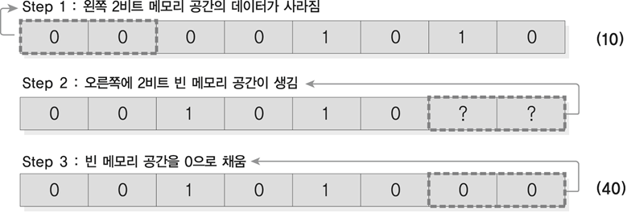
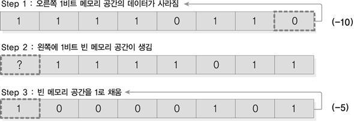

- [Part1-5장. 연산자란 무엇인가](#part1-5장-연산자란-무엇인가)
  - [1. 변수와 변수의 시작 주소](#1-변수와-변수의-시작-주소)
  - [2. 연산자의 종류](#2-연산자의-종류)
  - [3. 비트 연산자](#3-비트-연산자)
  - [4. 연산자 우선순위](#4-연산자-우선순위)

# Part1-5장. 연산자란 무엇인가

## 1. 변수와 변수의 시작 주소

- 데이터를 저장하는 공간을 변수라고 하며 위치를 가지고 있음
- 지역변수: 중괄호와 중괄호 사이에 들어있는 변수

## 2. 연산자의 종류

- 연산자: 연산을 수행하는 기호
- 피연산자: 연산에 참여하는 변수나 상수의 값
  ex) `3+5` (피연산자: 3, 5 / 연산자: `+`)

1. 대입연산자: 오른쪽에 있는 값을 왼쪽에 있는 변수에 대입(저장)

   ex) `i=3` → `i`라는 공간에 3을 넣어라

2. 산술연산자: `+`, `-`, `*`, `/`, `%` → 컴퓨터에서는 CPU가 두뇌역할

   | 산술 연산자       | 예       | 설명                                       |
   | ----------------- | -------- | ------------------------------------------ |
   | +(덧셈 연산자)    | a = 6+2  | 피연산자6과 피연산자 2의 덧셈 연산         |
   | -(뺄셈 연산자)    | a = 6-2  | 피연산자 6과 피연산자 2의 뺄셈 연산        |
   | \*(곱하기 연산자) | a = 6\*2 | 피연산자 6과 피연산자 2의 곱셈 연산        |
   | /(나누기 연산자)  | a = 6/2  | 피연산자 6과 피연산자 2의 나눗셈 연산      |
   | %(나머지 연산자)  | a = 6%2  | 피연산자 6과 피연산자 2를 나눈 나머지 연산 |

3. 복합 대입 연산자: 산술 연산자와 대입 연산자를 하나로 나타냄

   | 복합 대입 연산자 | 같은 표현 | 설명                                    |
   | ---------------- | --------- | --------------------------------------- |
   | a = a + b        | a += b    | a + b를 먼저 수행한 후에 a에 값을 저장  |
   | a = a – b        | a -= b    | a - b를 먼저 수행한 후에 a에 값을 저장  |
   | a = a \* b       | a \*= b   | a \* b를 먼저 수행한 후에 a에 값을 저장 |
   | a = a / b        | a /= b    | a / b를 먼저 수행한 후에 a에 값을 저장  |
   | a = a % b        | a %= b    | a % b를 먼저 수행한 후에 a에 값을 저장  |

   - `a=+1`: a에 +1을 저장해라
   - `a+=1`: a에 1을 더한 값을 a에 저장해라

4. 증감 연산자: 1증가 또는 1감소시키는 연산자

   | 증감 연산자 | 설명                                          |
   | ----------- | --------------------------------------------- |
   | ++a         | 선 증가, 후 연산 (먼저 증가하고 그 다음 연산) |
   | a++         | 선 연산, 후 증가 (먼저 연산하고 그 다음 증가) |
   | --a         | 선 감소, 후 연산 (먼저 감소하고 그 다음 연산) |
   | a--         | 선 연산, 후 감소 (먼저 연산하고 그 다음 감소) |

   - 단독으로 쓰일 때는 결과가 같지만 연산이 들어가 있을 때는 다르게 나옴

5. 관계 연산자: 관계를 비교하여 참과 거짓으로 결론 (항상 왼쪽을 기준으로 함)

   | 관계 연산자 | 예   | 설명                           |
   | ----------- | ---- | ------------------------------ |
   | >           | a>b  | a가 b보다 클지를 비교          |
   | <           | a<b  | a가 b보다 작을지를 비교        |
   | >=          | a>=b | a가 b보다 크거나 같을지를 비교 |
   | <=          | a<=b | a가 b보다 작거나 같을지를 비교 |
   | ==          | a==b | a가 b보다 같을지를 비교        |
   | !=          | a!=b | a가 b보다 같지 않을지를 비교   |

   - 실세계 관계: 좋다, 나쁘다
   - 컴퓨팅세계 관계: 참(1), 거짓(0)
     - 1, 2, 3, 4, 100, -50 모두 참을 의미 (1로 표현 할 수 있기 때문)

6. 논리 연산자: 두 관계가 합쳤을 때 참인지 거짓인지 판단

   | &&  | 둘 다 참인 경우만 참이다      |
   | --- | ----------------------------- | --- | -------------------------- |
   |     |                               |     | 둘 중 하나만 참이면 참이다 |
   | !   | 참이면 거짓, 거짓이면 참이다. |

7. 조건 연산자
   - `(조건식) ? (식1) : (식2)` → 조건식이 참이면 식1을, 거짓이면 식2를 수행

## 3. 비트 연산자

- 비트: 0과 1을 저장할 수 있는 최소 메모리 공간
  → 컴퓨터는 모든 정보를 0과 1로 표현함
  (1비트-2개, 2비트-4개, 3비트-8개, n비트- $2^n$개)
  - 8비트=1바이트
  - 1000바이트=1K바이트
  - 1000K바이트=1M바이트
  - 1000M바이트=1G바이트
  - 1000G바이트=1Tera바이트
- 2진수, 10진수, 16진수, 8진수

  - 2진수: 0~1까지의 숫자를 사용
  - 10진수: 0~9까지의 숫자를 사용
  - 16진수: 0~9까지의 숫자를 사용하고, 9이후부터 a, b, c, d, e, f 문자사용
  - 8진수: 0~7까지의 숫자를 사용

    > 10진수: 일상적인 표현법/ 2진수, 16진수, 8진수: 컴퓨팅 세계 표현법

- 비트 연산자

  - 데이터를 비트 단위로 처리함
  - 피연산자 2개, 주소 연산자: 변수 앞에 붙임

  - `&`연산자(AND): 두 개의 비트가 모두 1일 때 1을 반환
  - `|`연산자(OR): 두 개의 비트 중의 하나가 1일 때 1을 반환
  - `^`연산자(XOR): 두 개의 비트가 서로 같지 않을 경우 1을 반환
  - `~`연산자(NOT): 보수 연산으로 비트를 반전시킴

    > Msb(Most significant bit) 부호 비트: 1이면 음수, 0이면 양수 나타냄

- 비트 이동 연산자
  - `<<`연산자(왼쪽 시프트):　비트를 왼쪽으로 이동시킴  
    ex) `num1<<2;`
    
    - 남은 자리를 0으로 채움
      (왼쪽으로 1비트씩 이동할 때마다 2씩 곱해짐)
  - `>>`연산자(오른쪽 시프트): 비트를 오른쪽으로 이동시킴  
    ex) `num2>>1;`
    
    - 남은 자리를 양수인 경우 0으로, 음수인 경우 1로 채움
      (오른쪽으로 1비트씩 이동할 때 마다 2씩 나누어짐)

## 4. 연산자 우선순위

| 우선순위 | 연산자                             | 연산 방향       |
| -------- | ---------------------------------- | --------------- |
| 1        | () [] -> .                         | 왼쪽에서 오른쪽 |
| 2        | ~ ~ ++-- + - \* &                  | 오른쪽에서 왼쪽 |
| 3        | \* / %                             | 왼쪽에서 오른쪽 |
| 4        | + -                                | 왼쪽에서 오른쪽 |
| 5        | << >>                              | 왼쪽에서 오른쪽 |
| 6        | < <= >>=                           | 왼쪽에서 오른쪽 |
| 7        | == !=                              | 왼쪽에서 오른쪽 |
| 8        | &                                  | 왼쪽에서 오른쪽 |
| 9        | ^                                  | 왼쪽에서 오른쪽 |
| 10       | \|                                 | 왼쪽에서 오른쪽 |
| 11       | &&                                 | 왼쪽에서 오른쪽 |
| 12       | \|\|                               | 왼쪽에서 오른쪽 |
| 13       | ?:                                 | 오른쪽에서 왼쪽 |
| 14       | = += -= \*= /= %= &= ^= != <<= >>= | 오른쪽에서 왼쪽 |
| 15       | ,                                  | 왼쪽에서 오른쪽 |
