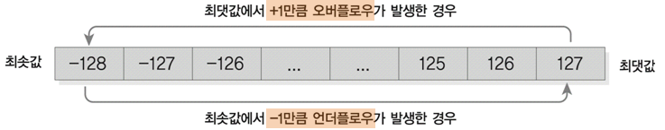

- [Part1-6장. 자료형이란 무엇인가](#part1-6장-자료형이란-무엇인가)
  - [1. 자료형이란](#1-자료형이란)
  - [2. 정수형](#2-정수형)
  - [3. 실수형](#3-실수형)
  - [4. 문자형](#4-문자형)
  - [5. 자료형 변환](#5-자료형-변환)
  - [6. typedef를 이용한 자료형의 재정의](#6-typedef를-이용한-자료형의-재정의)

# Part1-6장. 자료형이란 무엇인가

## 1. 자료형이란

- 자료형(data type): 변수가 저장하는 데이터 형식
- 자료형의 종류

  - 정수형: 정수를 표현하는 데이터 타입(char(문자), short, int, long)
  - 실수형: 소수점이 포함된 값을 표현하는 데이터 타입(float, double, long double)

  ex) 귤을 넣으면 귤 박스, 포도를 넣으면 포도 박스

- 자료형의 크기

  - sizeof 연산자: 자료형의 크기를 구할 수 있음

    (메모리의 크기에 따라서 데이터를 저장할 수 있는 범위가 달라짐)

    - `sizeof(자료형)`: `printf(“%d”, sizeof(int));` → 자료형 메모리 크기
    - `sizeof(변수)`: `int num = 3; printf(“%d”, sizeof(num));` → 변수 메모리 크기

  - 정수형: char(1바이트), short(2바이트), int(4바이트), long(최소 4바이트)
  - 실수형: float(4바이트), double(8바이트), long double(최소 8바이트)

## 2. 정수형

| 정수형 | 메모리 크기     | 데이터 표현 범위                |
| ------ | --------------- | ------------------------------- |
| char   | 1바이트(8비트)  | -128 ~ +127 (아스키코드: 0~127) |
| short  | 2바이트(16비트) | -32768 ~ +32767                 |
| int    | 4바이트(32비트) | -2147483648 ~ +2147483647       |
| long   | 4바이트(32비트) | -2147483648 ~ +2147483647       |

- 데이터 표현 범위: $2^{n-1}$~$2^{n-1}-1$ (n은 비트 수)
  ex) int의 메모리 크기
  $-2^{32-1}\sim2^{32-1}-1=-(2\times2^{10}\times2^{10}\times2^{10})\sim(2\times2^{10}\times2^{10}\times2^{10})-1$
  $= -(2\times10^{3}\times10^{3}\times10^{3})\sim(2\times10^{3}\times10^{3}\times10^{3})-1$ → 약 -20억~ 20억

  - `limits.h`: 정수형 데이터 표현 최솟값과 최댓값 상수 제공
    (정수형 데이터 표현 범위를 자동으로 알려주는 라이브러리)
    | 정수형 | 최솟값 상수 | 최댓값 상수 |
    | ------ | ----------- | ----------- |
    | char | CHAR_MIX | CHAR_MAX |
    | short | SHRT_MIX | SHRT_MAX |
    | int | INT_MIX | INT_MAX |
    | long | LONG_MIX | LONG_MAX |
  - `unsigned`: 정수형의 양수 범위를 두 배로 늘림 (0과 양수만 표현)

    | 정수형                        | 메모리 크기                | 데이터 표현 범위 |
    | ----------------------------- | -------------------------- | ---------------- |
    | char(signed char)             |
    | unsigned char                 | 1바이트(8비트)             |
    | 1바이트(8비트)                | -128 ~ +127                |
    | 0 ~ (127 +128)                |
    | short(signed short)           |
    | unsigned short                | 2바이트(16비트)            |
    | 2바이트(16비트)               | -32768 ~ +32767            |
    | 0 ~ (32767 + 32768)           |
    | int(signed int)               |
    | unsigned int                  | 4바이트(32비트)            |
    | 4바이트(32비트)               | -2147483648 ~ + 2147483647 |
    | 0 ~ (2147483647 + 2147483648) |
    | long(signed long)             |
    | unsigned long                 | 4바이트(32비트)            |
    | 4바이트(32비트)               | -2147483648 ~ + 2147483647 |
    | 0 ~ (2147483647 + 2147483648) |

    > signed: 부호가 있는, unsigned: 부호가 없는

  - `limits.h`: unsigned형 상수의 데이터 표현 최댓값 상수 제공
    | unsigned 정수형 | 상수(최댓값) |
    | --------------- | ------------ |
    | unsigned char | UCHAR_MAX |
    | unsigned short | USHRT_MAX |
    | unsigned int | UINT_MAX |
    | unsigned long | ULONG_MAX |

    > 최솟값은 0이기 때문에 제공하지 않음

  - CPU는 int형을 가장 빠르게 처리함
    - 대부분의 컴퓨터들은 32비트(4바이트) 이상의 시스템임
    - CPU가 정수를 연산할 때 최소 32비트(4바이트)씩 끌고 옴
      - char형: 1바이트를 4바이트로 만들고 가져와야함 (성능 떨어짐)
      - int형: 처음부터 4바이트여서 변환할 필요 없음 (속도 유지)
        
      - 오버플로우: 자료형에 저장할 수 있는 최대 범위보다 큰 수 저장
        - char a=-129; → &d로 찍으면 127이 나옴
      - 언더플로우: 자료형에 저장할 수 있는 최소 범위보다 작은 수 저장
        - char a=128; → &d로 찍으면 -128이 나옴
          > 정수형의 오버플로우와 언더플로우는 순환된 값을 출력

## 3. 실수형

| 실수형      | 메모리 크기     | 데이터 표현 범위 |
| ----------- | --------------- | ---------------- |
| float       | 4바이트(32비트) | 1.17* ~3.40*     |
| double      | 8바이트(64비트) | 2.22* ~1.79*     |
| long double | 8바이트(64비트) | 2.22* ~1.79*     |

- 데이터가 약 20억을 넘어갈 때 사용
- 소수점은 정밀도가 높음

- `float.h`: 실수형 데이터 표현 최솟값과 최댓값 상수 제공하는 헤더파일

  | 실수형      | 최솟값　상수 | 최댓값 상수 |
  | ----------- | ------------ | ----------- |
  | float       | FLT_MIX      | FLT_MAX     |
  | double      | DBL_MIX      | DBL_MAX     |
  | long double | LDBL_MIX     | LDBL_MAX    |

- 고정 소수점: `%f`, `%lf` → float형 오차 발생, double형 선호
  | 실수형 | 표현 가능한 소수점 이하 자리 수 |
  | ----------- | ------------------------------- |
  | float | 소수점 이하 6자리 |
  | double | 소수점 이하 15자리 |
  | long double | 소수점 이하 15자리 또는 그 이상 |

  - double형: `%.15lf`라고 지정하지 않으면 기본으로 6자리까지 출력
    > double형 선호: 오차 적음, 정밀도 높음, 컴파일러는 기본적으로 실수형을 double로 인식
    >
    > - 소수점을 가진 실수들을 float으로 데이터를 만들어도 double로 인식함
        → 뒤에 소수점 뒤에 F를 붙여야 경고가 안 뜸

- 부동 소수점: `%e`, `%le` → 데이터가 길어지면 10의 몇 승으로 표현 가능 12245…

## 4. 문자형

- 컴퓨터(CPU)는 문자를 인식하지 못함 → a, b, A, B를 숫자로 인식함

- 컴퓨터는 ASCII 코드를 참조해서 문자를 인식함

  - ASCII 코드: 정보를 교환하기 위한 표준 (0~127 - 문자)

- 문자형은 char형을 선호
  - 작은따옴표 안에 문자 하나만 입력 (큰 따옴표 X)
  - 영문자 하나는 1바이트, 한글은 2바이트 (자음+모음)
    - 아스키코드의 0~127은 기본적으로 알파벳과 특수기호만 해당

## 5. 자료형 변환

- int (4바이트 정수) → double (8바이트 실수)

  - 작은형에서 큰형으로 갈 때는 괜찮음 (데이터 손실 없음)
  - 큰형에서 작은형으로 갈 때 문제 생김 (데이터 손실 있음)

- 자동 형변환: 컴파일러가 자동으로 변환

  - 단순 연산:　작은형이 큰형으로 자동 형변환 (정수+실수 or 실수+정수)

    - char < int < long < float < double < long double

  - 대입 연산: 대입 연산자를 기준으로 오른쪽에서 왼쪽으로 자동 형변환
    ex) `int num = 3.14;` → 정수부분만 들어감 (데이터 손실)

- 강제 형변환: 프로그래머가 판단에 의해서 강제로 변환
  ex) `int num=2;` → `(double) num;`

## 6. typedef를 이용한 자료형의 재정의

- `typedef`: 자료형을 정의함 (기본 자료형에 새로운 이름을 붙임)
  - 자료형을 간결하게 표현 가능
  - 프로그램의 가독성을 높일 수 있음
  - 너무 남용하면 자료형 분석 시 혼란 초래
    ex) `typedef int mytype;` → 지금부터 `int`를 `mytype`으로 봐라!
