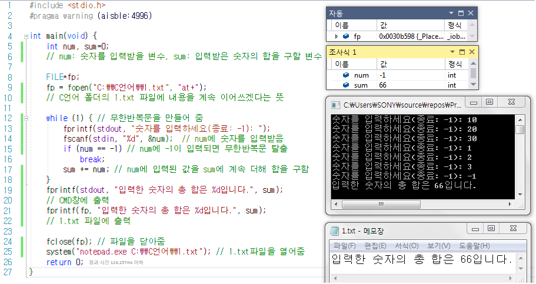
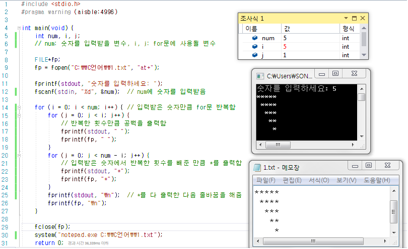
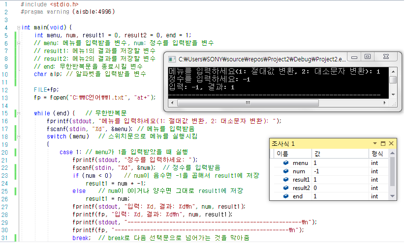
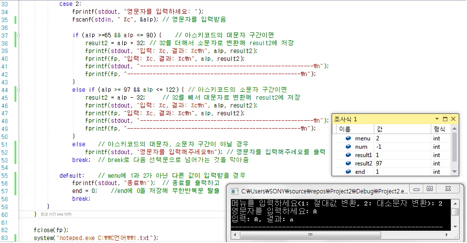
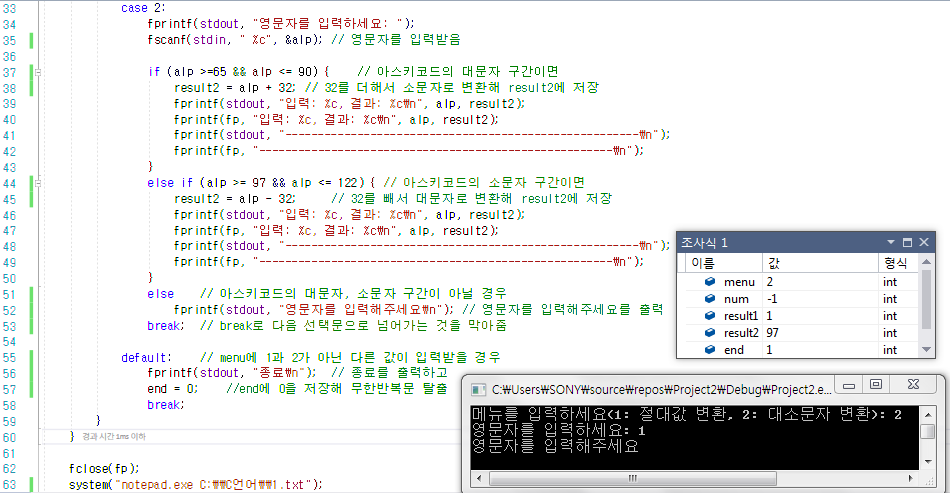
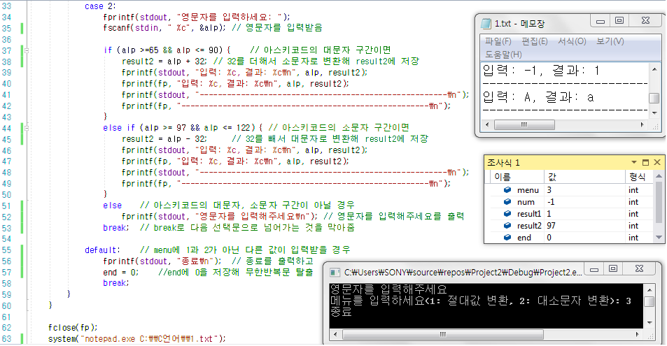
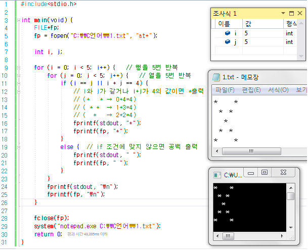

- [Part1-6장. 자료형이란 무엇인가](#part1-6장-자료형이란-무엇인가)
- [Part1-7장. 반복문이란 무엇인가](#part1-7장-반복문이란-무엇인가)
  - [숫자를 계속 입력받고 -1을 입력받으면 그 전에 입력했던 수들의 최종 합을 출력해주는 프로그램](#숫자를-계속-입력받고--1을-입력받으면-그-전에-입력했던-수들의-최종-합을-출력해주는-프로그램)
  - [숫자를 입력받아 입력받은 숫자로부터 하나씩 개수가 줄어드는 별(\*)을 오른쪽 정렬로 출력해주는 프로그램](#숫자를-입력받아-입력받은-숫자로부터-하나씩-개수가-줄어드는-별을-오른쪽-정렬로-출력해주는-프로그램)
  - [숫자를 입력받아 반복문을 사용해 거듭제곱을 구하는 프로그램](#숫자를-입력받아-반복문을-사용해-거듭제곱을-구하는-프로그램)
  - [메뉴 번호를 입력받아 다음 조건에 맞게 출력하는 프로그램](#메뉴-번호를-입력받아-다음-조건에-맞게-출력하는-프로그램)
  - [연습문제 5번](#연습문제-5번)

# Part1-6장. 자료형이란 무엇인가

# Part1-7장. 반복문이란 무엇인가

## 숫자를 계속 입력받고 -1을 입력받으면 그 전에 입력했던 수들의 최종 합을 출력해주는 프로그램

## 숫자를 입력받아 입력받은 숫자로부터 하나씩 개수가 줄어드는 별(\*)을 오른쪽 정렬로 출력해주는 프로그램

## 숫자를 입력받아 반복문을 사용해 거듭제곱을 구하는 프로그램

## 메뉴 번호를 입력받아 다음 조건에 맞게 출력하는 프로그램

[조건 1] : 1번 메뉴는 정수를 입력받아 해당 정수의 절대값을 출력한다.

[조건 2] : 2번 메뉴는 알파벳을 입력받아 소문자면 대문자로, 대문자면 소문자로 변환하고, 영문자가 아닐 시 올바르지 않은 입력임을 출력한다.

[조건 3] : 메뉴 입력은 무한 루프이며, (1)과 (2)번 메뉴 입력이 아닐 시 프로그램이 종료한다.

## 연습문제 5번

