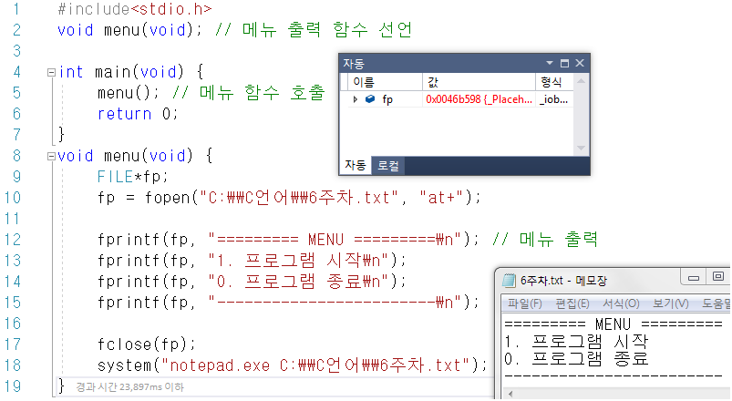
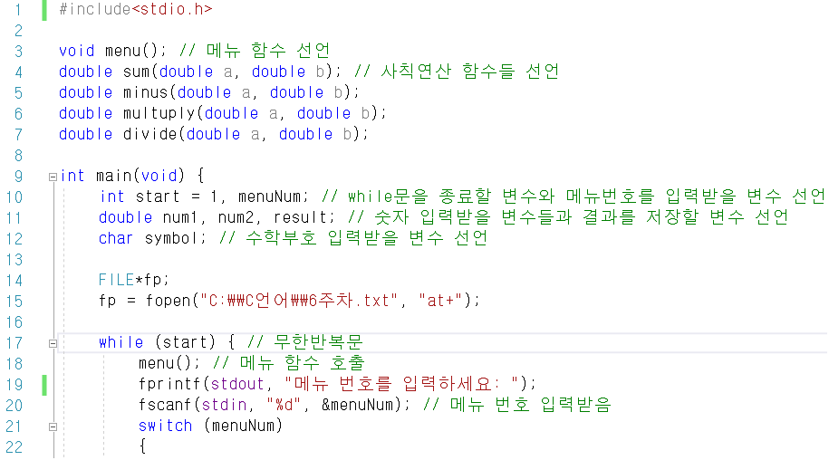
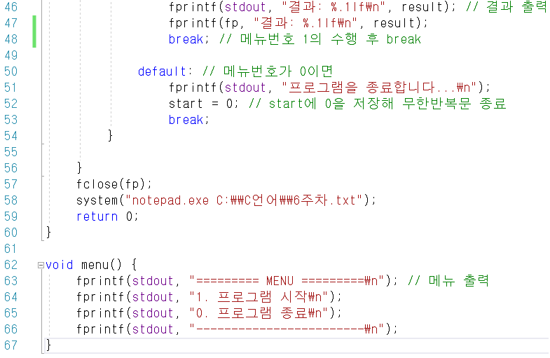
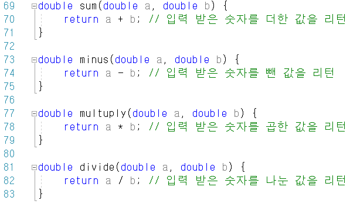
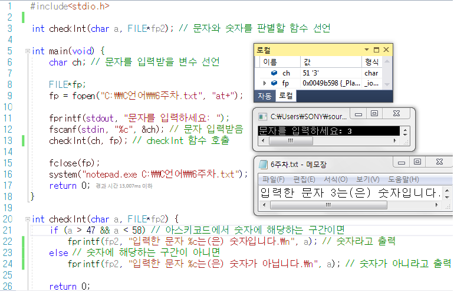
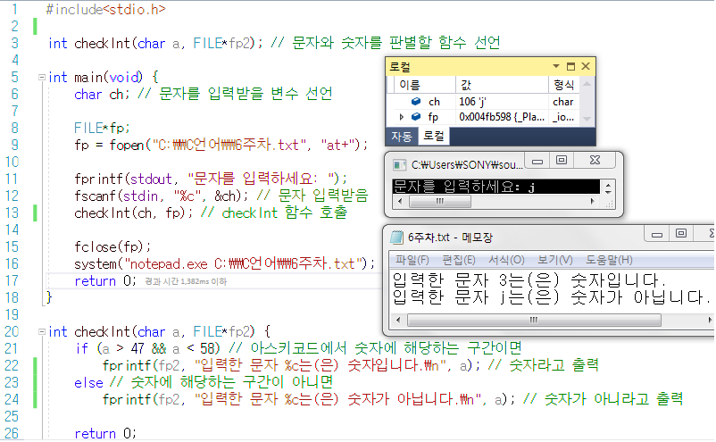
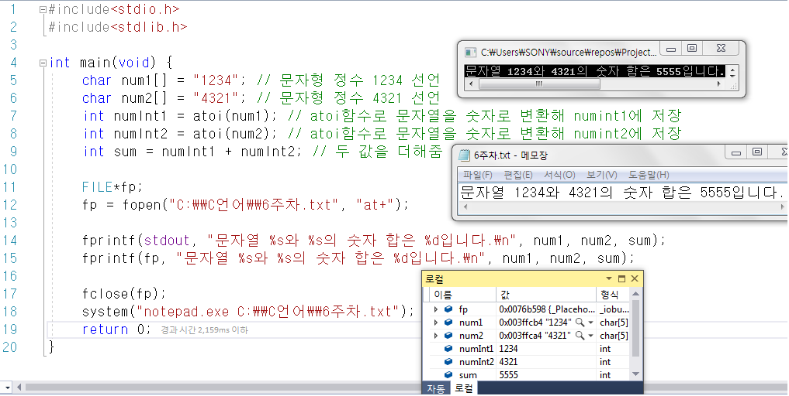
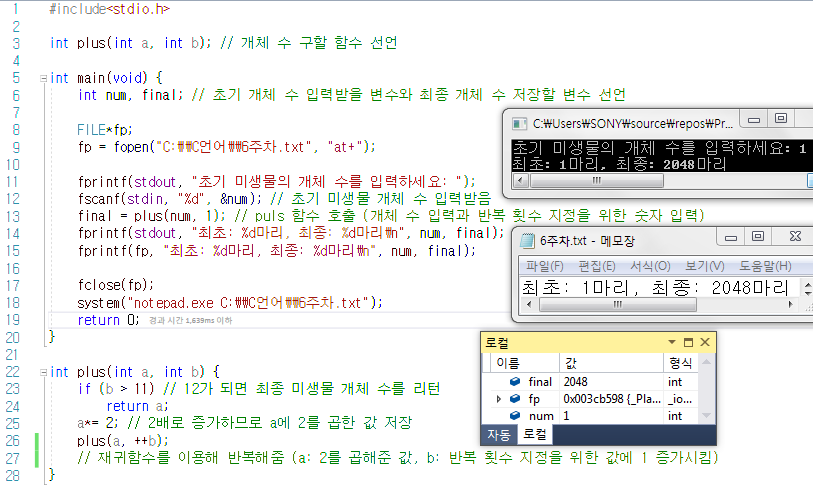
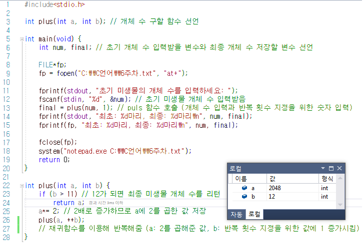
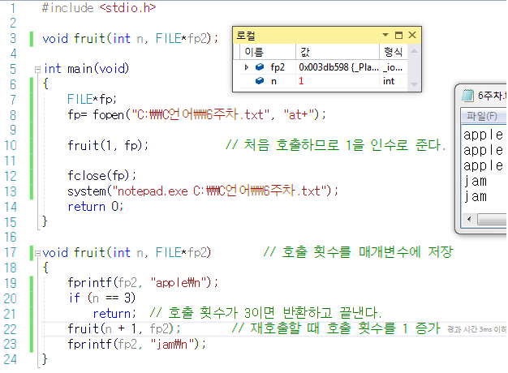

- [Part1-9장. 함수란 무엇인가](#part1-9장-함수란-무엇인가)
  - [printf 함수를 사용해 \[실행화면\]과 같은 메뉴를 출력해주는 함수 void menu()를 만들어 메뉴를 출력](#printf-함수를-사용해-실행화면과-같은-메뉴를-출력해주는-함수-void-menu를-만들어-메뉴를-출력)
  - [두 수를 입력받아 더한 값을 리턴하는 함수 double sum(double, double)을 정의하고 \[실행화면\]과 같은 프로그램](#두-수를-입력받아-더한-값을-리턴하는-함수-double-sumdouble-double을-정의하고-실행화면과-같은-프로그램)
  - [\[문제 2\]번을 참고로 사칙연산에 관한 함수를 모두 정의하고 \[문제 1\]의 메뉴 함수와 결합해 사칙연산을 수행하는 프로그램](#문제-2번을-참고로-사칙연산에-관한-함수를-모두-정의하고-문제-1의-메뉴-함수와-결합해-사칙연산을-수행하는-프로그램)
  - [문자 하나를 입력받아 숫자인지 아닌지 판별하는 함수 int checkInt(char)를 정의하고 입력한 문자가 숫자인지 아닌지 판별하는 프로그램](#문자-하나를-입력받아-숫자인지-아닌지-판별하는-함수-int-checkintchar를-정의하고-입력한-문자가-숫자인지-아닌지-판별하는-프로그램)
  - [atoi 함수를 사용해 문자열 상수“1234” 와 “4321”을 정의하고 두 문자열을 숫자로 변환해 더한 수를 출력하는 프로그램](#atoi-함수를-사용해-문자열-상수1234-와-4321을-정의하고-두-문자열을-숫자로-변환해-더한-수를-출력하는-프로그램)
  - [미생물A의 최초 개수를 입력받고, 미생물이 1월부터 12월까지 세포분열한다 했을 때 최종 개체수는 몇 개인지를 구하는 프로그램](#미생물a의-최초-개수를-입력받고-미생물이-1월부터-12월까지-세포분열한다-했을-때-최종-개체수는-몇-개인지를-구하는-프로그램)
  - [예제 7-7.c](#예제-7-7c)

# Part1-9장. 함수란 무엇인가

## printf 함수를 사용해 [실행화면]과 같은 메뉴를 출력해주는 함수 void menu()를 만들어 메뉴를 출력

## 두 수를 입력받아 더한 값을 리턴하는 함수 double sum(double, double)을 정의하고 [실행화면]과 같은 프로그램

## [문제 2]번을 참고로 사칙연산에 관한 함수를 모두 정의하고 [문제 1]의 메뉴 함수와 결합해 사칙연산을 수행하는 프로그램

실행결과:

## 문자 하나를 입력받아 숫자인지 아닌지 판별하는 함수 int checkInt(char)를 정의하고 입력한 문자가 숫자인지 아닌지 판별하는 프로그램

## atoi 함수를 사용해 문자열 상수“1234” 와 “4321”을 정의하고 두 문자열을 숫자로 변환해 더한 수를 출력하는 프로그램

stdlib.h 헤더에 정의되어 있는 atoi 함수는 사용자가 입력한 문자형 정수를 실제 정수형으로 변환해주는 함수이다.

## 미생물A의 최초 개수를 입력받고, 미생물이 1월부터 12월까지 세포분열한다 했을 때 최종 개체수는 몇 개인지를 구하는 프로그램

A라는 미생물은 한 달에 한번 세포분열하여 개체 수가 2배로 증가한다.

(단, 재귀함수로 구현하며 전역변수 및 정적(static)변수 사용 금지)

## 예제 7-7.c

→ 재귀함수가 종료할 때 n이 다시 하나씩 적어짐
