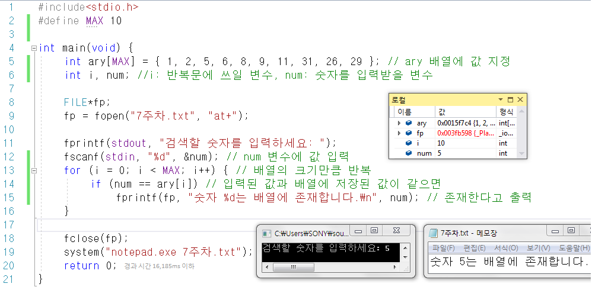
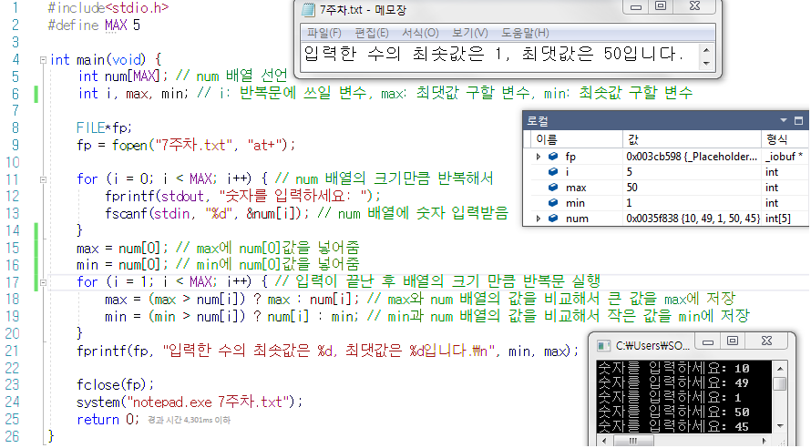
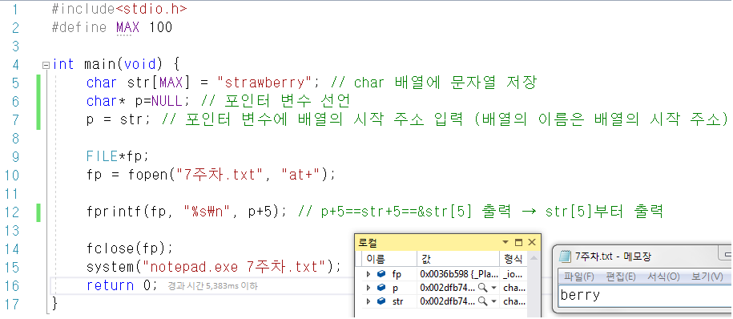
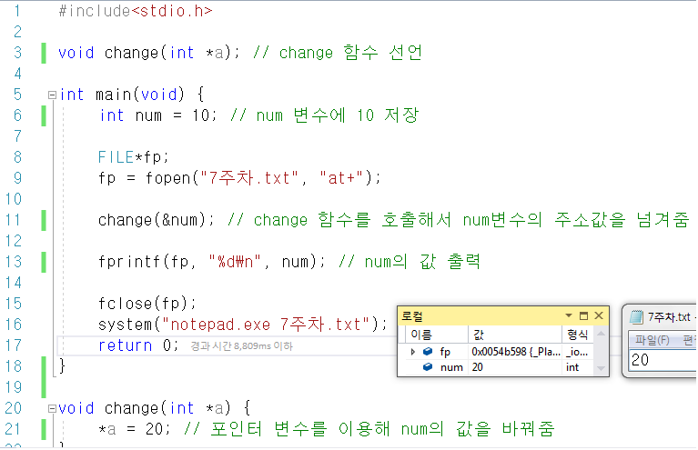
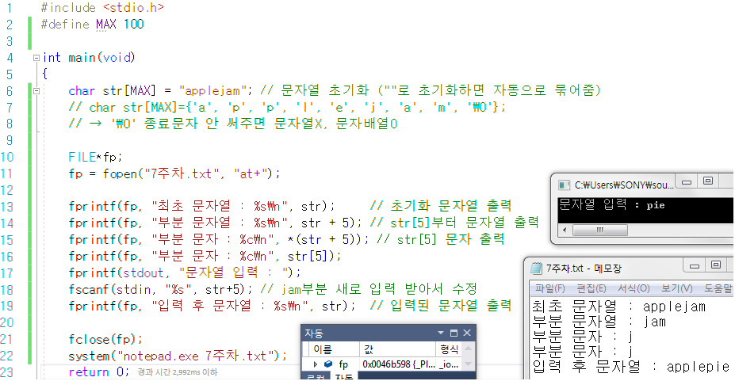
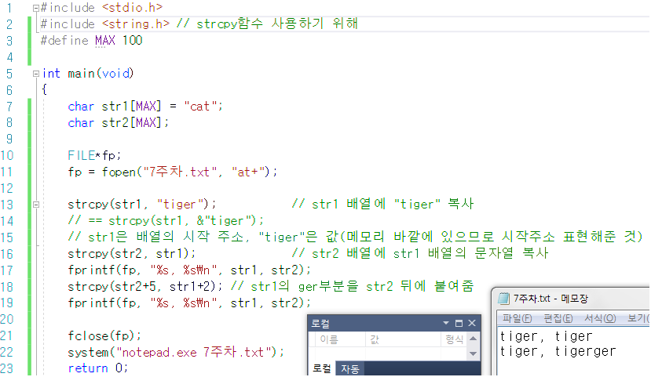
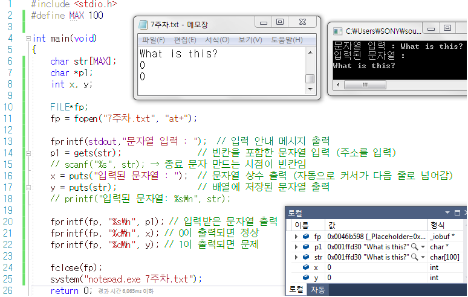
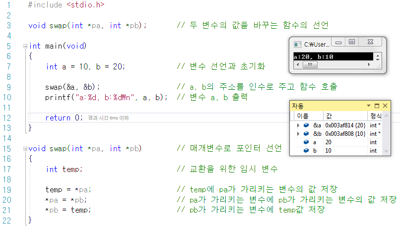

- [Part2-1장. 1차원 배열이란 무엇인가](#part2-1장-1차원-배열이란-무엇인가)
- [Part2-3장. 포인터란 무엇인가](#part2-3장-포인터란-무엇인가)
  - [정수형 1차원 배열 ary를 int ary\[10\] = {1,2,5,6,8,9,11,31,26,29}와 같이 초기화한 후 숫자를 입력받아 해당 숫자를 검색하는 프로그램을 작성하세요.](#정수형-1차원-배열-ary를-int-ary10--12568911312629와-같이-초기화한-후-숫자를-입력받아-해당-숫자를-검색하는-프로그램을-작성하세요)
  - [사용자로부터 5개의 숫자를 입력받아 정수형 배열에 저장하고, 배열을 순회하며 최댓값과 최솟값을 찾아 출력하는 프로그램을 작성하세요.](#사용자로부터-5개의-숫자를-입력받아-정수형-배열에-저장하고-배열을-순회하며-최댓값과-최솟값을-찾아-출력하는-프로그램을-작성하세요)
  - [문자 배열 char str\[100\] = {"strawberry"}을 선언하고 포인터 변수를 사용해 'berry'를 출력하는 프로그램을 작성하세요.](#문자-배열-char-str100--strawberry을-선언하고-포인터-변수를-사용해-berry를-출력하는-프로그램을-작성하세요)
  - [정수형 변수의 값을 변경하는 함수 void change(int \*) 함수를 선언 및 정의하고 10으로 초기화되어있는 변수 num을 change 함수를 사용해 20으로 바꾸어 출력하는 프로그램을 작성하세요.](#정수형-변수의-값을-변경하는-함수-void-changeint--함수를-선언-및-정의하고-10으로-초기화되어있는-변수-num을-change-함수를-사용해-20으로-바꾸어-출력하는-프로그램을-작성하세요)
  - [문자열을 저장하는 char형 배열](#문자열을-저장하는-char형-배열)
  - [문자열을 대입하는 strcpy 함수](#문자열을-대입하는-strcpy-함수)
  - [빈칸을 포함한 문자열 입력](#빈칸을-포함한-문자열-입력)
  - [포인터를 사용한 두 변수의 값 교환](#포인터를-사용한-두-변수의-값-교환)

# Part2-1장. 1차원 배열이란 무엇인가

# Part2-3장. 포인터란 무엇인가

## 정수형 1차원 배열 ary를 int ary[10] = {1,2,5,6,8,9,11,31,26,29}와 같이 초기화한 후 숫자를 입력받아 해당 숫자를 검색하는 프로그램을 작성하세요.

## 사용자로부터 5개의 숫자를 입력받아 정수형 배열에 저장하고, 배열을 순회하며 최댓값과 최솟값을 찾아 출력하는 프로그램을 작성하세요.

## 문자 배열 char str[100] = {"strawberry"}을 선언하고 포인터 변수를 사용해 'berry'를 출력하는 프로그램을 작성하세요.

## 정수형 변수의 값을 변경하는 함수 void change(int \*) 함수를 선언 및 정의하고 10으로 초기화되어있는 변수 num을 change 함수를 사용해 20으로 바꾸어 출력하는 프로그램을 작성하세요.

## 문자열을 저장하는 char형 배열

## 문자열을 대입하는 strcpy 함수

## 빈칸을 포함한 문자열 입력

→ p1은 문자를 입력한 시작 주소 저장하고 있음

## 포인터를 사용한 두 변수의 값 교환

