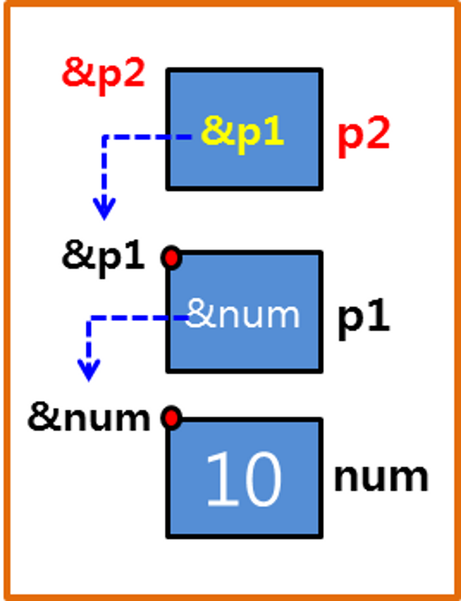

- [Part2-3장. 다차원 포인터란 무엇인가](#part2-3장-다차원-포인터란-무엇인가)
  - [1. 다차원 포인터 변수의 선언과 사용](#1-다차원-포인터-변수의-선언과-사용)
  - [2. 주소의 가감산](#2-주소의-가감산)
  - [3. 함수 포인터](#3-함수-포인터)

# Part2-3장. 다차원 포인터란 무엇인가

## 1. 다차원 포인터 변수의 선언과 사용

- 다차원 포인터 변수: 2차원 이상의 포인터 변수

  ex) `int** p2=NULL;` (2차원 포인터), `int*** p3=NULL;` (3차원 포인터)

  > 모든 포인터 변수는 4바이트

- 2차원 포인터 변수: 1차원 포인터 변수의 주소를 저장

  ```c
  #include <stdio.h>
  int main(void)
  {
  	int num=10;
  	int*  p1=NULL;
  	int** p2=NULL;

  	p1=&num;
  	p2=&p1;

  	return 0;
  }
  ```

  

  - `**p2==*p1==num==10`

- 3차원 포인터 변수: 2차원 포인터 변수의 주소를 저장

  ```c
  #include <stdio.h>
  int main(void)
  {
  	int num=10;
  	int*  p1=NULL;
  	int** p2=NULL;
  	int*** p3=NULL;

  	p1=&num;
  	p2=&p1;
  	p3=&p2;

  	return 0;
  }
  ```

  

  - `***p3==**p2==*p1==num==10`

## 2. 주소의 가감산

```c
#include <stdio.h>
int main(void)
{
	char c='A';
	char* cp=NULL;
	char** cpp=NULL;

	cp=&c;
	cpp=&cp;

	return 0;
}
```

- `&c+1`, `&cp+1`, `&cpp+1` (A에서 +1만큼 가서 B)
  - char의 주소에 +1 → 1바이트 건너뜀
  - 포인터 변수의 주소에 +1 → 4바이트 건너뜀

## 3. 함수 포인터

- 함수 포인터: 함수의 시작 주소를 저장 (4바이트)

  ex) `int (*pointer) (int, int)` → `(자료형) (함수 포인터 이름) (인수 자료형 목록)`

  - 가리키는 대상이 되는 함수의 인수들의 자료형 목록을 써줌
  - 함수 이름은 함수의 시작 주소

    ```c
    void add(int a, int b); // 포인터 대상 함수 선언
    int main(void)
    {
    	int a=3, b=5;
    	void (*pointer) (int, int); // 함수 포인터 선언

    	pointer=add; // 함수 포인터에 함수 시작 주소 저장
    	pointer(x, y); // 함수 포인터를 이용한 호출

    	return 0;
    }
    void add(int a, int b)
    {
    	int result;
    	result=a+b;
    	printf("%d + %d = %d", a, b, result);
    }
    ```

    - 조건문 사용 시 포인터 변수 하나로 2개의 함수를 가리킬 수 있음

- 함수 포인터의 필요성: 일반적인 함수 호출 보다 빠른 처리 속도
  - 포인터변수(4바이트)로 함수의 많은 내용을 참조 가능
  - 컴파일러, 인터프리터, 게임 프로그래밍과 같은 시스템 프로그래밍 분야에 사용
