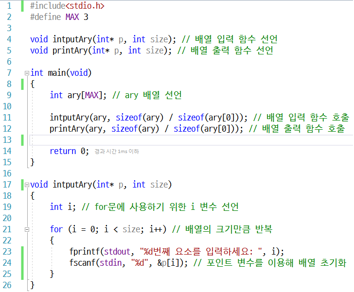
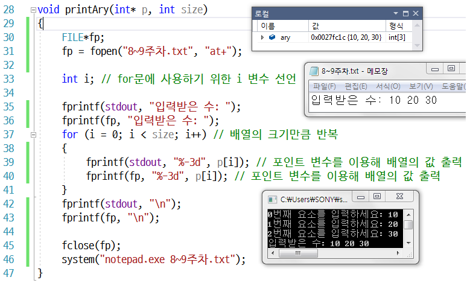
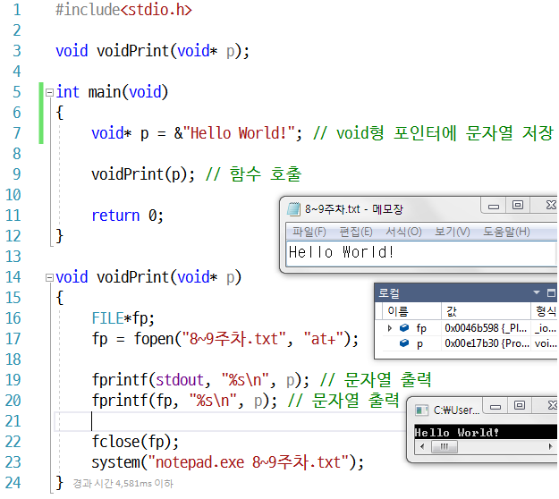
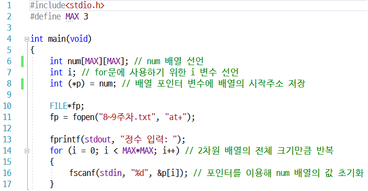
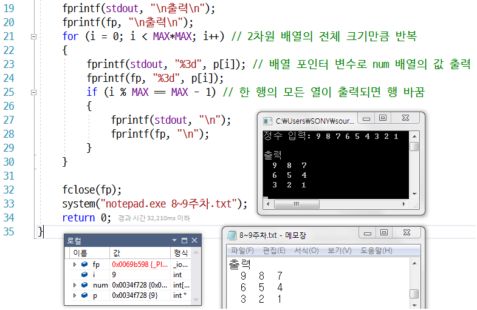
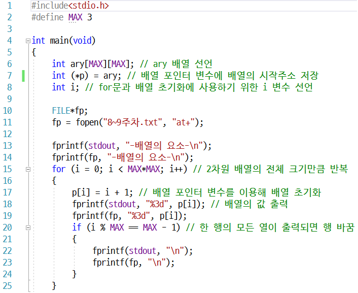
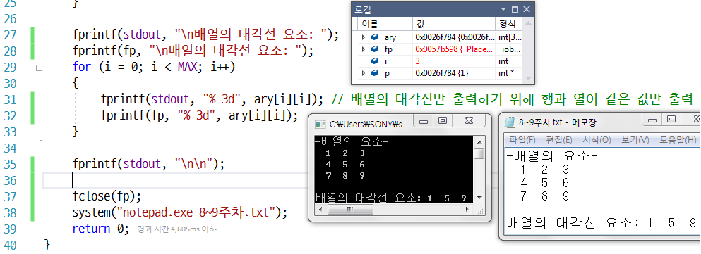
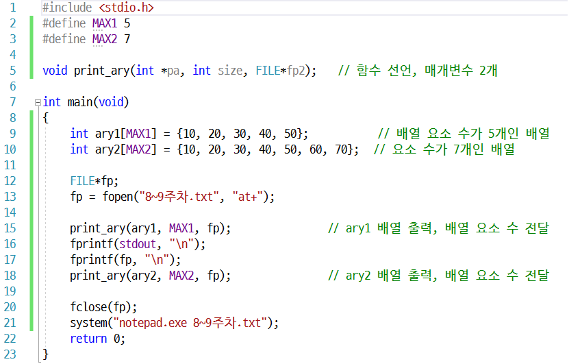
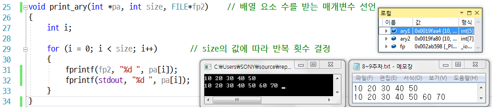
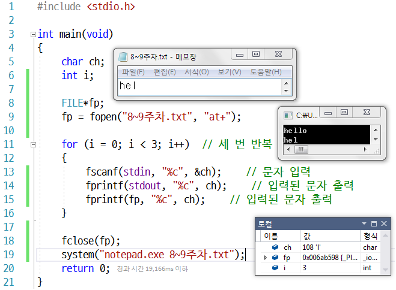

- [Part2-4장. 포인터와 배열](#part2-4장-포인터와-배열)
  - [계산기 프로그램을 작성하세요.](#계산기-프로그램을-작성하세요)
  - [문제 1번에서 작성한 프로그램은 사용자가 숫자가 아닌 문자를 입력 했을 때 무한루프가 돌게 됩니다. 이를 해결해 프로그램을 수정하세요.](#문제-1번에서-작성한-프로그램은-사용자가-숫자가-아닌-문자를-입력-했을-때-무한루프가-돌게-됩니다-이를-해결해-프로그램을-수정하세요)
  - [사용자로부터 문자열을 입력받아 입력받은 문자열을 거꾸로 출력해주는 프로그램을 작성하세요. 사용자에게 최대 255자를 입력받습니다.](#사용자로부터-문자열을-입력받아-입력받은-문자열을-거꾸로-출력해주는-프로그램을-작성하세요-사용자에게-최대-255자를-입력받습니다)
  - [사용자로부터 문자열을 입력 받아 공백 단위로 쪼개어 재출력해주는 프로그램을 작성하세요.](#사용자로부터-문자열을-입력-받아-공백-단위로-쪼개어-재출력해주는-프로그램을-작성하세요)
  - [rewind 함수가 필요한 경우](#rewind-함수가-필요한-경우)
  - [문자열 상수가 주소란 증거](#문자열-상수가-주소란-증거)
  - [strncpy 함수를 사용한 문자열 복사](#strncpy-함수를-사용한-문자열-복사)
  - [strcat, strncat 함수를 사용한 문자열 붙이기](#strcat-strncat-함수를-사용한-문자열-붙이기)

# Part2-4장. 포인터와 배열

## 1차원 배열의 주소와 배열의 크기를 매개변수로 하는 배열 입력 함수 inputAry 와 배열 출력 함수 printAry를 만들어 배열을 초기화하고 출력하는 프로그램을 작성하세요.

## void 형 포인터에 문자열 “Hello World!"의 주소를 저장하고, void 형 포인터가 가리키는 문자열을 출력하는 void voidPrint(void \*) 함수를 정의하여 출력하세요.

## 사용자로부터 정수 9개를 입력받아 3 X 3 크기의 2차원 배열에 저장하고 배열 포인터 변수를 사용해 배열의 요소를 출력하는 프로그램을 작성하세요.

## 다음 [실행화면]과 [요구사항]에 맞는 프로그램을 작성하세요

임의의 n × n 배열을 순회하면서 1부터 까지 초기화합니다.
배열의 대각선 요소들만 출력합니다.
배열의 크기가 달라져도 정상 작동해야합니다.

## 크기가 다른 배열을 출력하는 함수

## 버퍼를 사용하는 문자입력

