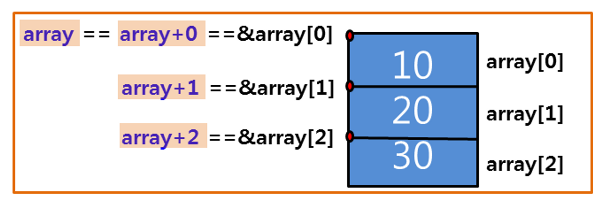

- [Part2-4장. 포인터와 배열](#part2-4장-포인터와-배열)
  - [1. 포인터와 1차원 배열](#1-포인터와-1차원-배열)
  - [2. 포인터 배열](#2-포인터-배열)
  - [3. 포인터와 문자 그리고 포인터와 문자열](#3-포인터와-문자-그리고-포인터와-문자열)

# Part2-4장. 포인터와 배열

## 1. 포인터와 1차원 배열

- 배열의 이름 == 배열의 시작 주소

  

  - int형 크기 4byte → 배열의 크기 12byte
  - `array+1` → 4byte만큼 이동한 위치
  - `sizeof(array)` → `array`의 전체 크기 (12byte)
  - `sizeof(array+0)` → `array[0]`의 크기 (4byte)

- 포인터 변수를 통한 1차원 배열 요소의 주소 접근

  ```c
  int array[3]={10, 20, 30};
  int* p=NULL;
  p=array; == p=&array[0]; == p=array+0;
  ```

  - `p == p+0 == &p[0] == array == &array[0] == array+0`  
    `*p == *(p+0) == *&p[0] == p[0] == *array == *&array[0] == array[0] == *(array+0)`

    > 포인터 변수(4byte)로 대량의 데이터인 `array`배열(12byte)에 접근할 수 있음

- 포인터 변수와 배열의 크기 차이

  - 포인터 변수: 4바이트로 고정 → 주소를 저장해 간접접근 가능
  - 배열: 배열 길이에 따라 가변적

- 주소의 가감산을 이용한 배열의 접근

  ```c
  p=array; == p=array[0] // p[0], p[1], p[2]
  p=array+1; == p=array[1] // p[-1], p[0], p[1]
  p=array+2; == p=array[2] // p[-2], p[-1], p[0]
  ```

  - `array[0]`, `array[1]`, `array[2]`

  ```c
  p=array; == p=array[0] // p[0], p[1], p[2]
  p=p+1; == p=array[1] // p[-1], p[0], p[1]
  p=p+1 == p=array[2] // p[-2], p[-1], p[0]
  ```

  - `array[0]`, `array[1]`, `array[2]`

  ```c
  p=array;
  *p=10;
  *(p+1)=20;
  *(p+2)=30;
  ```

  - `array[0]=10`, `array[1]=20`, `array[2]=30`

  ```c
  p=array;
  *p=10;
  p=p+1;
  *p=20;
  p=p+1;
  *p=30;
  ```

  - `p[-2]=10`, `p[-1]=20`, `p[0]=30`

- 포인터의 뺄셈과 관계 연산
  ```c
  int ary[5]={10, 20, 30, 40, 50};
  int* pa=ary;
  int* pb=pa+3;
  ```
  - `pb - pa` → (40 - 32) / `sizeof(int)` → 8/4 → 2
    - 뺄셈 결과는 배열 요소 간 간격 차이 (논리적)
      > `pb - pa` → 40 - 32 → 4 (물리적)

## 2. 포인터 배열

- 포인터 배열: 주소를 저장하는 배열 ex) `int* p[3];`

  - 자료형: 포인터 배열의 자료형 지정, 자료형 다음에 \* 연산자 붙임
  - 포인터 배열 이름: 주소를 저장할 배열 이름 지정
  - 배열 길이: 주소를 저장할 배열의 전체 길이 지정

    > `int* p[3];` (포인터 배열) != `int (*p) [3];` (배열 포인터)

- 포인터 배열의 필요성

  - 포인터 변수가 많아지면 관리 어려움
  - 포인터 배열의 요소로 주소를 체계적으로 관리 할 수 있음

- 포인터 배열과 배열 포인터의 차이
  - 배열 포인터: 3열 가진 2차원 배열의 시작 주소를 저장  
    ex) `int (*p) [3]=NULL;`
  - 포인터 배열: 주소를 저장할 수 있는 배열  
    ex) `int* p[3]={NULL, NULL, NULL};`

## 3. 포인터와 문자 그리고 포인터와 문자열

- 문자 상수

  - `‘ ’` 내에 포함된 하나의 문자
  - 키보드로 표현할 수 있는 영문자와 숫자, 특수 기호  
    ex) `b=1;` → 연산 가능 / `b='1';` → 연산 불가능, 문자 (컴파일 후에는 의미 없음)
  - 문자와 정수는 메모리에 저장되는 방식이 같음

    > `scanf` 함수로 int형 변수에 문자 입력 시 → 메모리의 한 바이트 공간에만 저장 (쓰레기값)

- 문자 배열

  - 문자 상수를 저장하고 있는 배열
  - 배열에 저장된 문자 변경 가능
    ex) `char a[5]={'A', 'B', 'C', 'D', 'E'};`

- 문자 배열과 포인터

  - 배열에 저장된 문자를 포인터를 통해 접근
  - 문자 데이터를 배열에 넣으면 변경 가능

- 문자 입출력 함수: 문자만 입출력할 때 효율적 (`printf`와 `scanf`는 크기가 크므로 비효율적)

  - `getchar`: 매개변수가 없으므로 괄호만 사용하여 호출  
    → 키보드로 입력한 문자 아스키 코드값 반환 (int형 변수 사용)
  - `putchar`: 문자 아스키 코드값 인수로 주면 출력 (출력한 문자 다시 반환)  
    → 출력 과정에서 오류 발생하면 -1 반환

    > `ctrl+z` → 문자 입력 끝내고 -1 반환  
    > `puts`, `gets` → 문자열 입출력

- 문자열
  - `“ ”` 내에 포함된 하나 이상의 문자 ex) `'A'` → 문자 / `"A"` → 문자열
  - 문자열의 끝에는 문자열의 끝을 알리는 종료 문자(`\0`) 삽입 ex) `"A"` == `"A\0"`
  - 문자열의 시작 주소를 알면 저장된 문자들에 접근 가능
  - 문자열은 문자열 상수와 문자열 변수로 구분  
    ex) `"ABCD"` → 상수 (값 변경X)  
    `char a[5]="ABCD";` == `char a[5]={'A', 'B', 'C', 'D', '\0'};`
    → 배열화해서 값 변경 가능
  - 문자열을 입력하고 출력할 때 서식문자 `%s`를 사용
    → 문자열의 시작 주소를 통해 출력 (시작주소부터 종료문자까지)
  - 메모리 공간에 연속으로 저장되어 있어 주소가 연속적 ex) `&a[0]`, `&a[1]`

```c
char array[ ]="ABCD";	// 문자열 변수 (변경 O)
char* p="ABCD"; == char* p=&"ABCD"; // 문자열 상수 (변경 X)

p[0]='X'; // 변경 불가능
array[0]='X'; // 변경 가능

p=array; // 변경 가능
array=array+1; // 변경 불가능 (상수이므로 값이 고정되어 있음)
```

> `char array1[ ]={'A', 'B', 'C', 'D', '\0'};` → 문자열 배열  
> `char array2[ ]={'A', 'B', 'C', 'D'};` → 문자 배열 (`%s`로 출력하면 이상한 값 나옴)

- 널 문자

  - 종료문자 `‘\0’`
  - ASCII 코드 정수 0(10진수)
  - 문자열 끝에 저장

- 널 포인터

  - 주소로 0 의미
  - 포인터 변수에 아무 주소도 저장하지 않겠다는 의미
  - 널 포인터를 사용할 때는 반드시 대문자를 사용
    ex) `int* p=NULL;`

- 포인터 변수의 상수화: const 키워드 이용

  - 포인터 변수에 다른 주소를 저장하지 못하게 함  
    ex) **`char* const p=&a;`** → `*p='C';` (가능) / `p=&b;` (불가능)
  - 포인터 변수를 통해 메모리 공간의 값을 변경하지 못하게 함  
    ex) **`const char p=&a;`** → `p=&b;`(가능) /`\*p='D';` (불가능)
  - 둘 다 못하게 함  
    ex) **`const char* const p=&a;`** → `p=&b;`, `*p='D';` (불가능)

- 버퍼를 사용하는 입력 함수

  - 버퍼: 프로그램의 실행 중 운영체제가 자동 할당하는 임시 저장 공간
    - 필요한 데이터를 한꺼번에 저장
  - `scanf` 함수: 버퍼에 저장된 입력받은 데이터를 변수에 입력함
    - 숫자 입력하는 경우 문자열의 형태로 버퍼에 저장된 후에 실제 연산이 가능한 값으로 변환되어 변수에 저장  
      ex) 20 입력 → ‘2’와 ‘0’이 각각 아스키 코드 값으로 코드화되어 버퍼에 저장된 후 연산이 가능한 숫자로 변환되어 변수에 저장
  - `getchar` 함수: 키보드로 입력한 한 줄을 char 배열에 문자열 저장

    > `EOF` == -1 (끝을 의미 → End Of File)  
    > `scanf`와 `getchar` 함수는 같은 버퍼 사용 → 입력 데이터 공유

- `fflush` 함수: 버퍼에 남아 있는 불필요한 데이터 제거  
  ex) `fflush(stdin)` → 입력 버퍼 내용 지움
  > `fgets`, `fputs` 함수: `stdin`, `stdout` 직접 표시  
  >  ex) `int ch=fgetc(stdin);`, `fpuc(ch, stdout);`
