- [Part1-9장. 변수의 영역과 데이터 공유](#part1-9장-변수의-영역과-데이터-공유)
- [Part2-2장. 다차원 배열이란 무엇인가](#part2-2장-다차원-배열이란-무엇인가)
- [Part2-3장. 다차원 포인터란 무엇인가](#part2-3장-다차원-포인터란-무엇인가)
- [Part2-4장. 포인터와 배열](#part2-4장-포인터와-배열)
- [Part2-5장. 포인터와 함수 그리고 void형 포인터](#part2-5장-포인터와-함수-그리고-void형-포인터)
- [Part3-4장. 메모리 동적 할당](#part3-4장-메모리-동적-할당)
  - [void max(int a, int b, int \*res) 는 정수 a, b 중 큰 값을 res변수에 저장 시켜주는 함수입니다. 사용자로부터 2개의 정수를 입력받아 max함수를 이용해 큰 수를 찾고 출력해주는 프로그램을 작성하세요.](#void-maxint-a-int-b-int-res-는-정수-a-b-중-큰-값을-res변수에-저장-시켜주는-함수입니다-사용자로부터-2개의-정수를-입력받아-max함수를-이용해-큰-수를-찾고-출력해주는-프로그램을-작성하세요)
  - [임의의 정수형 1차원 배열 arr를 선언하고 임의의 중복되지 않은 정수로 초기화한 뒤 사용자로부터 정수를 입력받아 배열에 해당 정수가 있는지 확인하고, 존재한다면 해당 주소를 리턴해주는 int\* find(int \*arr, int size, int num) 함수를 이용해 배열에 정수 존재 여부를 알려주는 프로그램을 작성하세요.](#임의의-정수형-1차원-배열-arr를-선언하고-임의의-중복되지-않은-정수로-초기화한-뒤-사용자로부터-정수를-입력받아-배열에-해당-정수가-있는지-확인하고-존재한다면-해당-주소를-리턴해주는-int-findint-arr-int-size-int-num-함수를-이용해-배열에-정수-존재-여부를-알려주는-프로그램을-작성하세요)
  - [정수형 2차원 배열 int ary\[4\]\[4\]를 선언하고 이 배열의 주소를 인자로 받아 초기화는 함수 initializeArray 함수를 선언 및 구현 하고 출력하세요.](#정수형-2차원-배열-int-ary44를-선언하고-이-배열의-주소를-인자로-받아-초기화는-함수-initializearray-함수를-선언-및-구현-하고-출력하세요)
  - [크기가 2인 포인터 배열을 선언해 사용자에게 입력받은 문자열을 동적할당시켜 저장하고, 2 문자열의 첫 글자를 비교해 알파벳 순서가 작은 쪽이 먼저 출력되도록 정렬하고 출력하는 프로그램을 작성하세요.](#크기가-2인-포인터-배열을-선언해-사용자에게-입력받은-문자열을-동적할당시켜-저장하고-2-문자열의-첫-글자를-비교해-알파벳-순서가-작은-쪽이-먼저-출력되도록-정렬하고-출력하는-프로그램을-작성하세요)
  - [교재의 예제 프로그램을 참고하여 사용자로부터 5개의 문자열을 입력받을 포인터 배열을 선언하고, 사용자에게 문자열을 입력할 때마다 동적할당 후 연결해줍니다. 만약 사용자가 5개가 넘는 문자열을 입력했을 경우 가장 오래된 문자열을 버리고 새로 입력한 문자열을 추가합니다.](#교재의-예제-프로그램을-참고하여-사용자로부터-5개의-문자열을-입력받을-포인터-배열을-선언하고-사용자에게-문자열을-입력할-때마다-동적할당-후-연결해줍니다-만약-사용자가-5개가-넘는-문자열을-입력했을-경우-가장-오래된-문자열을-버리고-새로-입력한-문자열을-추가합니다)
  - [수행시간 측정 코드](#수행시간-측정-코드)
  - [3명 학생의 네 과목 총점과 평균을 구하는 프로그램](#3명-학생의-네-과목-총점과-평균을-구하는-프로그램)

# Part1-9장. 변수의 영역과 데이터 공유

# Part2-2장. 다차원 배열이란 무엇인가

# Part2-3장. 다차원 포인터란 무엇인가

# Part2-4장. 포인터와 배열

# Part2-5장. 포인터와 함수 그리고 void형 포인터

# Part3-4장. 메모리 동적 할당

## void max(int a, int b, int \*res) 는 정수 a, b 중 큰 값을 res변수에 저장 시켜주는 함수입니다. 사용자로부터 2개의 정수를 입력받아 max함수를 이용해 큰 수를 찾고 출력해주는 프로그램을 작성하세요.

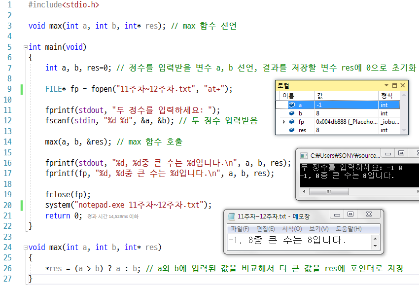

## 임의의 정수형 1차원 배열 arr를 선언하고 임의의 중복되지 않은 정수로 초기화한 뒤 사용자로부터 정수를 입력받아 배열에 해당 정수가 있는지 확인하고, 존재한다면 해당 주소를 리턴해주는 int* find(int *arr, int size, int num) 함수를 이용해 배열에 정수 존재 여부를 알려주는 프로그램을 작성하세요.

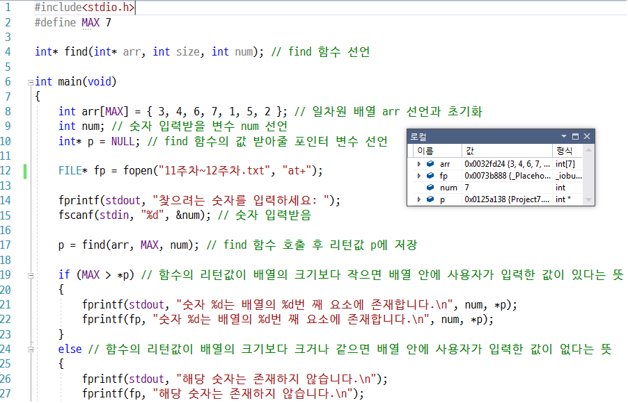

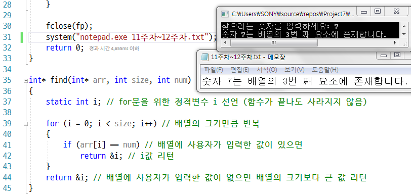

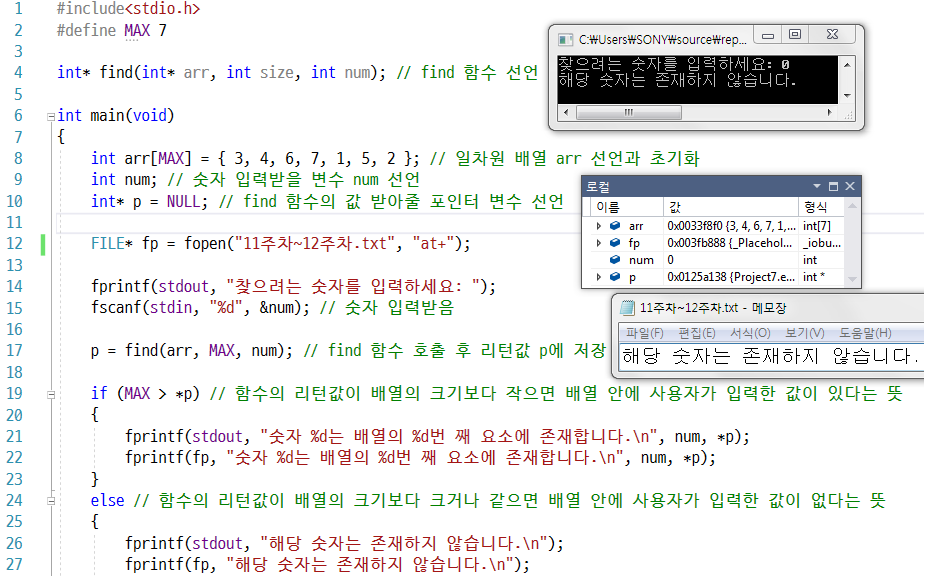

## 정수형 2차원 배열 int ary[4][4]를 선언하고 이 배열의 주소를 인자로 받아 초기화는 함수 initializeArray 함수를 선언 및 구현 하고 출력하세요.

배열의 인덱스(Index)를 통해 규칙을 찾고 2중 for문을 사용해 배열을 초기화합니다.

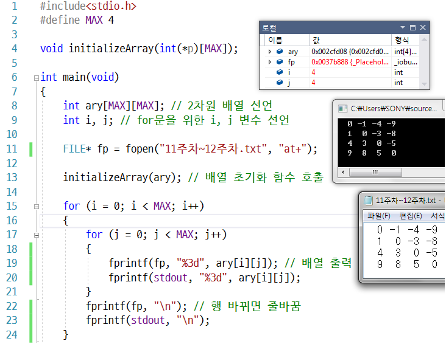

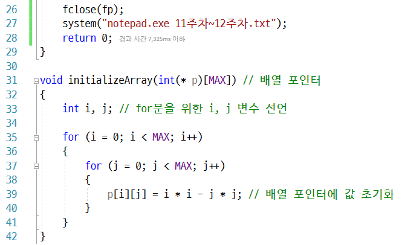

## 크기가 2인 포인터 배열을 선언해 사용자에게 입력받은 문자열을 동적할당시켜 저장하고, 2 문자열의 첫 글자를 비교해 알파벳 순서가 작은 쪽이 먼저 출력되도록 정렬하고 출력하는 프로그램을 작성하세요.

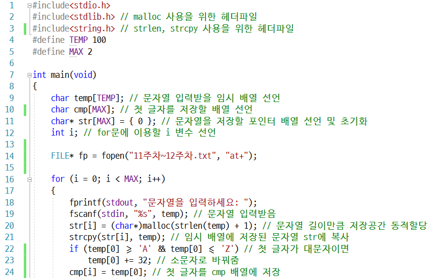

## 교재의 예제 프로그램을 참고하여 사용자로부터 5개의 문자열을 입력받을 포인터 배열을 선언하고, 사용자에게 문자열을 입력할 때마다 동적할당 후 연결해줍니다. 만약 사용자가 5개가 넘는 문자열을 입력했을 경우 가장 오래된 문자열을 버리고 새로 입력한 문자열을 추가합니다.

사용자가 엔터만 쳤을 때 프로그램을 종료합니다.

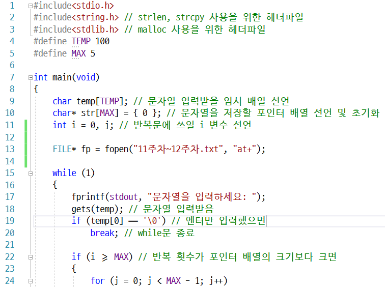

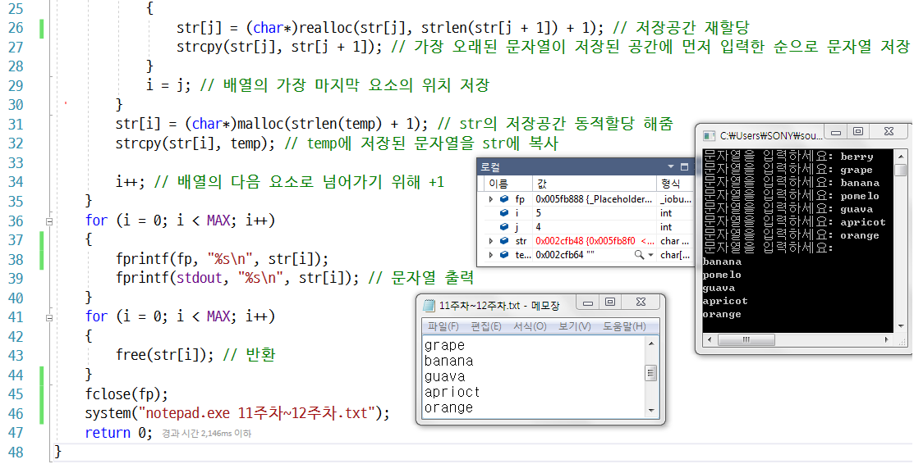

## 수행시간 측정 코드

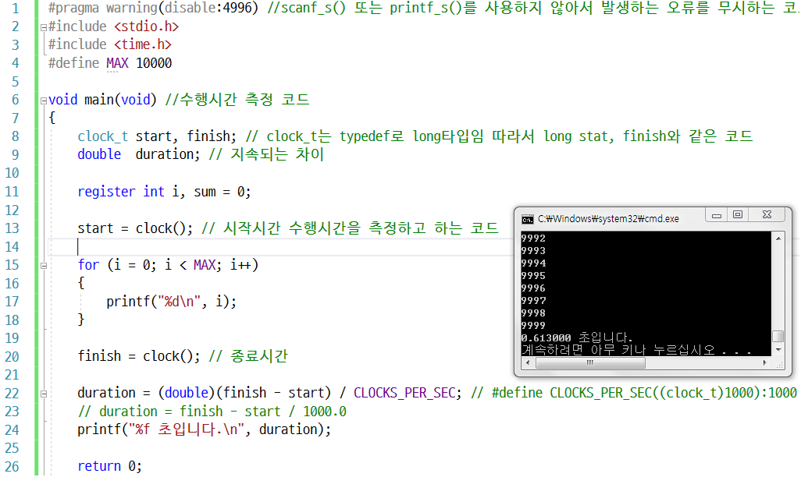

## 3명 학생의 네 과목 총점과 평균을 구하는 프로그램

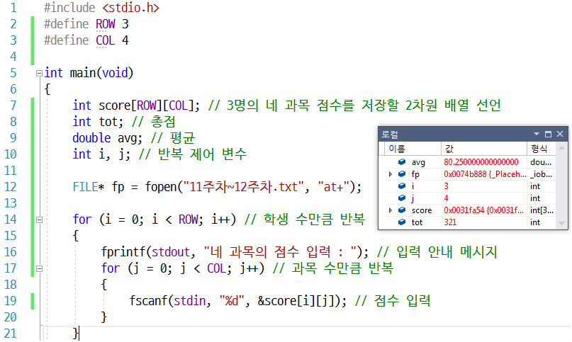

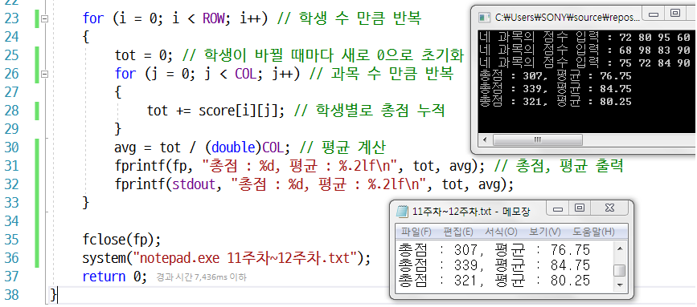
